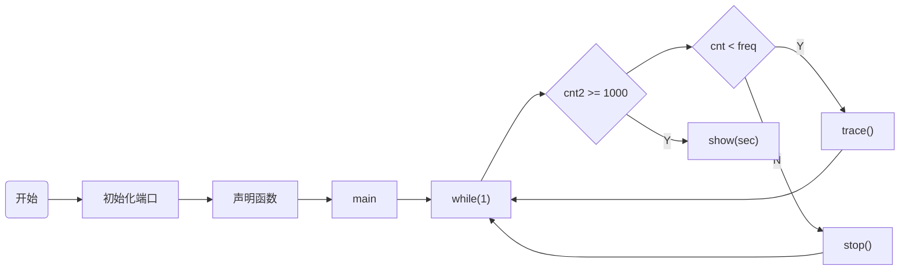
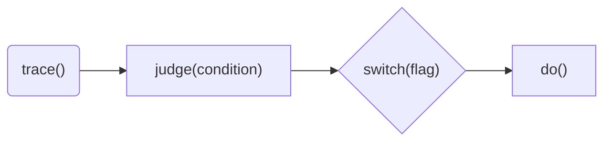
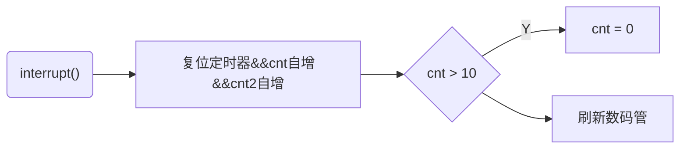

<!--
 * @Author: fengsc
 * @Date: 2021-09-06 09:51:00
 * @LastEditTime: 2021-09-06 11:02:40
-->
# lalala

```mermaid
graph LR;
执行0(开始)
执行1[初始化端口];
执行2[声明函数];
执行3[main];
循环1["while(1)"]
判断0{"cnt2 >= 1000"}
判断1{"cnt < freq"};
执行4["stop()"];
执行5["trace()"];
执行6["show(sec)"]
执行0 --> 执行1 -->执行2 -->执行3 --> 循环1;
判断0 --Y --> 执行6
循环1 -->判断0 --> 判断1
判断1 --Y -->执行5 --> 循环1;
判断1 --N -->执行4 -->循环1;

```

```mermaid
graph LR;
执行1("trace()")
执行4["judge(condition)"]
执行2{"switch(flag)"}
执行3["do()"]
执行1 --> 执行4 --> 执行2 -->执行3
```

```mermaid
graph LR
执行1("interrupt()")
执行2[复位定时器&&cnt自增&&cnt2自增]
判断1{"cnt > 10"}
执行3["cnt = 0"]
执行4[刷新数码管]
执行1 --> 执行2 -->判断1 --Y --> 执行3 
判断1 --> 执行4
```

```mermaid
graph LR
    fa:fa-check-->fa:fa-coffee
```
